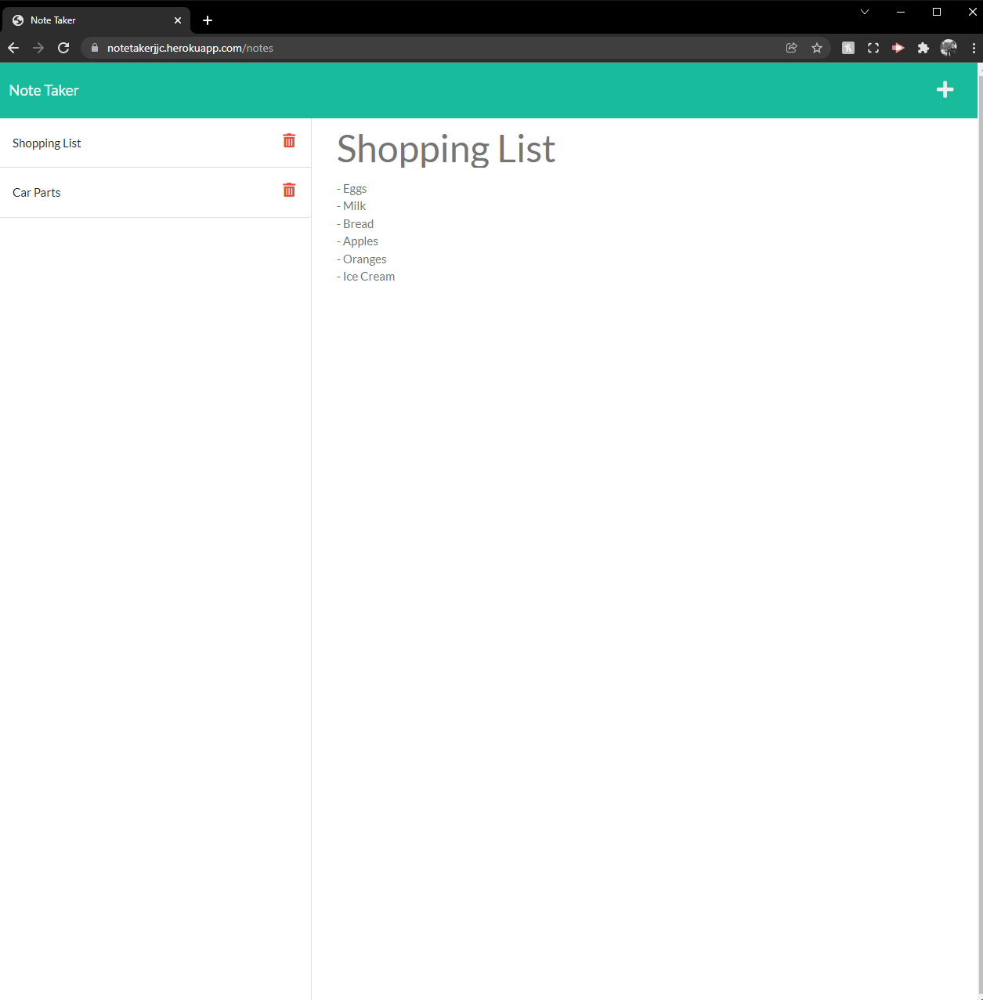

# Note Taker

## Description

In this project, I created a Note Taker web application that takes user input and stores it in to a JSON file. The file is used to grab the notes from, which can be displayed on the webpage.

The user can save quick notes with a title, along with a full note description. They can save the notes with the save icon, and create a new note with the plus icon. When they save, it is saved into the JSON file, and displayed on the list of notes, which can be selected and then displayed.

This project was created with the three basics, Javascript, HTML and CSS. However, starter code was already provided, which helped a lot. However, Express.js was used, which is used for creating routes. For example, after clicking the Clicked Started button, the notes.html is loaded. This also helps when saving notes. With the use of POST requests, they are saved into the JSON file.

This was an interesting project, as I had to learn about creating routes, however I found the POST function difficult. Therefore I will have to challenge myself and try and master this skill. Overall, I found this project enjoyable.

**Link**

Heroku Link: https://notetakerjjc.herokuapp.com/

